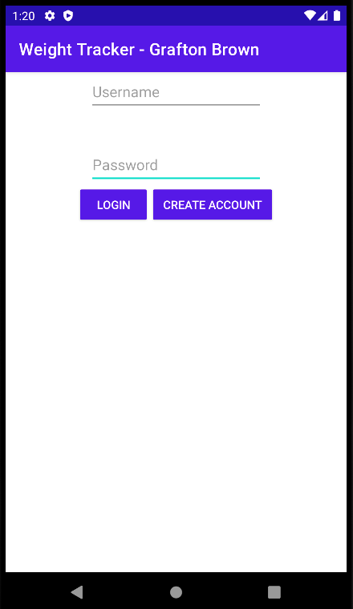
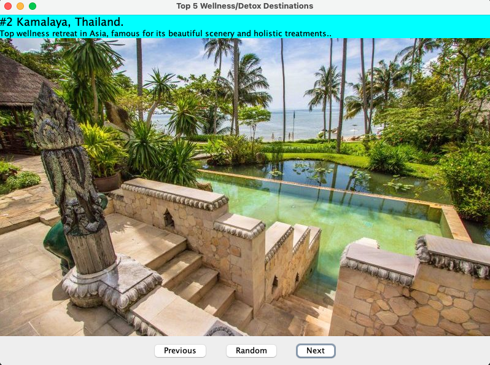
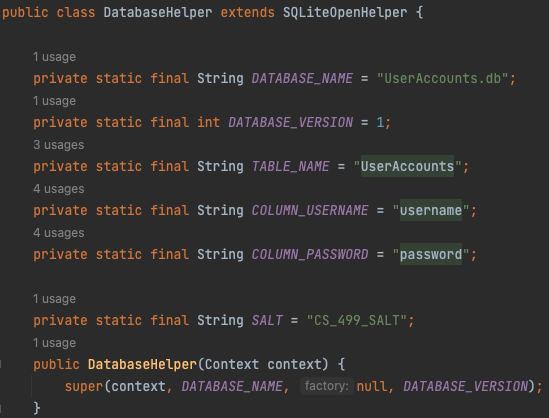

<h1 style="text-align: center;">Computer Science Capstone</h1>
<h2 style="text-align: center;">CS-499|| SNHU</h2>

## Code Review ##
A code review video provides a visual and collaborative platform for developers to assess and improve the quality of software code. It promotes knowledge sharing, identifies areas for enhancement, and fosters a culture of continuous improvement within development teams.

    <iframe width="560" height="315" src="https://www.youtube.com/embed/6w_f-GC5R3I" frameborder="0" allowfullscreen></iframe>

## Enhancement One: Software Engineering and Design ##

### Artifact Description ###

The chosen artifact for Milestone 2 is the Weight Loss app designed for CS-360, developed last term over the course of 8 weeks, from March to June 2023. It is an Android mobile application written in Java. The app includes features such as weight logging, goal setting, account creation, and an account management system.

### Justification for Inclusion ###

I have selected this artifact for my ePortfolio because it showcases my skills and abilities in software development, particularly in the areas of software engineering and design. The app's functionality and design demonstrate my capability to create a fully functional mobile application with multiple features, ensuring a seamless user experience.

The enhancements made to this artifact involved improvements in software design and engineering across various aspects of the app. I focused on refining the weight tracking system, eliminating redundancies, and adding new functionalities like the ability to edit, delete, and add entries.

### Reflection on the Enhancement Process ###

Throughout the enhancement process, I encountered several challenges, mainly due to the initial code's lack of modularity, maintainability, and comprehensibility. The code lacked proper commenting, making it difficult to understand, especially when dealing with more complex components. As a result, I learned the importance of writing clean, modular, and well-documented code that establishes a strong foundation for future maintenance and feature additions.

Another benefit was this enhancement process exposed me to various libraries, methods, patterns, and data structures that I was not familiar with previously. Utilizing an approach of iterative development allowed me to explore better ways to implement specific components and expand my knowledge in software development.

### Feedback Incorporation and Artifact Improvement ###

The artifact was significantly improved by addressing specific issues identified in the original version of the Weight Loss app. The weight-logging screen was non-functional and limited to 5 maximum entries, which was resolved by implementing a linear layout that dynamically generates a new row whenever the user logs a new weight. The addition of "Edit" and "Delete" buttons enabled users to modify or remove previously logged entries, enhancing both functionality and user experience.

Redundancies were also eliminated throughout the app, simplifying its appearance and improving user experience. This involved removing duplicate sections related to defining a goal weight, as well as enhancing screen navigation. Previously, users were unable to navigate between specific screens, but with the implemented changes, all screens accessible to the user can now be freely navigated in any order once logged in.

The application was also refactored and optimized to better adhere to coding conventions. Variables were renamed for readability, imports were optimized, Java files were refactored to allow for more modular code, again lending to further maintanability down the road.
### Alignment with Course Objectives ###

The enhancements made to the Weight Loss app align with my initial course objective goal, which was to "Demonstrate an ability to use well-founded and innovative techniques, skills, and tools in computing practices for the purpose of implementing computer solutions that deliver value and accomplish industry-specific goals." The improvements exemplify my ability to employ well-thought-out development practices to implement solutions that deliver value and adhere to coding conventions.

In conclusion, the process of enhancing the Weight Loss app allowed me to enhance its usability, functionality, and user experience while also achieving the desired course outcome. The challenges I faced and the feedback I incorporated served as valuable lessons in writing efficient and maintainable code, the enhancements represent my understandings and improvements within the category of Software Design and Engineering.

<small style="background-color: #F5F5DC; padding: 2px 4px; border-radius: 4px;">Download the artifact<a href="https://github.com/GraftonB/GraftonB.github.io/raw/2a5291528382fcb9f9a50cd70a67e74f88f110ab/WeightTrackerApp.zip"> here.</a></small>

<small style="background-color: #F5F5DC; padding: 2px 4px; border-radius: 4px;">See the artifacts narrative and code on<a href="https://github.com/GraftonB/GraftonB.github.io/tree/main/Weight_Loss_App"> github.</a></small>

## Enhancement Two: Data Structures and Algorithms ##

### Artifact Description ###

The chosen artifact for Milestone 3 is the Wellness Slide Show application designed for CS-250, Software Development Lifecycle. The artifact is written in Java and utilizes the Java Window Builder.

### Justification for Inclusion ###

I have selected the Slide Show application for my ePortfolio because it demonstrates my proficiency in data structures and algorithms (DSA). The artifact showcases my ability to evaluate an existing application critically and identify areas for improvement related to DSA. During the enhancement process, I successfully implemented changes that enhance efficiency, performance, maintainability, functionality, and reusability of the code, particularly focusing on two significant aspects: Slide Data Structure and Dynamic Slide Management.

### Reflection on the Enhancement Process ###

Throughout the enhancement process, I focused on eliminating redundancies across the application, streamlining the code, and commenting the more complex functions to provide information for future development. This approach improved the application's performance and simplified the user interface, resulting in more concise, reusable, and maintainable code. By critically evaluating the code and identifying areas for improvement, I expanded my knowledge of software design patterns, libraries, and methods, strengthening my understanding of best practices in software development.

### Feedback Incorporation and Artifact Improvement ###

I addressed the Slide Data Structure by creating a Slide class that encapsulates the image and description for each slide. This improvement provided a more organized and cohesive approach to handle slide information, ensuring that the image and description data are always synchronized. By utilizing either an Array to store instances of the Slide class, I established a unified data structure to manage the slides efficiently. This enhancement not only simplified operations but also contributed to making the code more maintainable and less prone to errors when updating or modifying slide information.

I also tackled the issue of hardcoded arrays with a fixed size of 5, which impeded scalability. To resolve this limitation, I replaced the fixed-size arrays with a dynamic data structure, namely an ArrayList. This change enables users to dynamically add or remove slides at runtime, providing more flexibility to the application. By introducing a constant `NUM_SLIDES` and utilizing the dynamic data structure, the application became more adaptable to changing requirements without extensive code modifications. This enhancement demonstrates my ability to design computing solutions that can adjust to varying scenarios, making the application more user-friendly and robust.

Additionally, I enhanced the functionality of the Slide Show application through the introduction of the "Random" button. This feature showcases my efficient use and application of DSA. The implementation required an understanding of algorithms to randomly select slides and improve user experience by providing a new experience each time the button is clicked.

### Alignment with Course Objectives ###

By implementing these enhancements, I hope to improve performance through optimized Data Structures and Algorithms (DSA). Utilizing a data structure like an array over the current implementation will greatly improve performance, with lower time and space complexity. The Wellness Retreat Slideshow will also be much more scalable because of implementing dynamic array sizes. The code will be more maintainable, functional, and reusable because of these enhancements.

This enhancements has illustrated my understanding of the importance of DSA, as well as provide insight into my problem-solving methodology, analytical thinking, and general programming skills. This enhancement will meet the course outcome of "Design and evaluate computing solutions that solve a given problem using algorithmic principles and computer science practices and standards appropriate to its solution, while managing the trade-offs involved in design choices."

In conclusion, the enhancements made to the Slide Show application exemplify my ability to review an application and identify/make improvements related to DSA, which enhance efficiency, performance, maintainability, functionality, and reusability. These skills are essential in the field of computer science as they ensure the delivery of high-quality solutions that meet industry-specific goals while adhering to best practices and standards. Through this project, I have demonstrated my competence in designing and evaluating computing solutions, effectively managing trade-offs in design choices, and using well-founded techniques and tools to deliver valuable applications. The Slide Show application serves as a testament to my growth as a computer scientist, and I am confident that it showcases my progress toward demonstrating desired course outcomes.

<small style="background-color: #F5F5DC; padding: 2px 4px; border-radius: 4px;">Download the artifact<a href="https://github.com/GraftonB/GraftonB.github.io/raw/main/SlideShow.zip"> here.</a></small>

<small style="background-color: #F5F5DC; padding: 2px 4px; border-radius: 4px;">See the artifacts narrative and code on<a href="https://github.com/GraftonB/GraftonB.github.io/tree/main/SlideShow_App"> github.</a></small>

## Enhancement Three: Databases ##

### Artifact Description ###
The chosen artifact for Milestone 4 is the Weight Loss app designed for CS-360, developed last term over the course of 8 weeks, from March to June 2023. It is an Android mobile application written in Java. The app serves as a weight loss tool, allowing users to log their weight, set goals, create user accounts, and manage weight-related information. It was implemented in Java and integrated with a default SQLite database for data storage.

### Justification for Inclusion
I have selected this artifact for inclusion in my ePortfolio because it demonstrates my software development skills, particularly in database management and security. The artifact highlights my ability to address critical issues in the original database implementation and improve the app's overall functionality and user experience.

### Feedback Incorporation and Artifact Improvement
The artifact underwent significant improvement through a series of enhancements planned in Module One. The initial database implementation lacked essential security features, such as input validation, encryption, and modularity. The database was also written in a non-modular manner, leading to less readable code and insufficient abstraction. To address these issues, I followed the enhancement plan and executed the following:

**Database Management:** I demonstrated my proficiency in database management by creating a separate DatabaseHelper class to handle interactions with the SQLite database. This enhancement encapsulates the database functionality and promotes modularity. This change enabled making the codebase more organized and maintainable.

**Input Validation and Sanitization:** The artifact showcases my understanding of data integrity and security. I implemented logic to sanitize and validate all user input before storing it in the database or checking it against account credentials. This enhancement mitigates potential vulnerabilities arising from incorrect or malicious input. Previously, there was no validation or sanitization, allowing users to create accounts with no login information and log weights consisting of non-integers. Now, every input is properly sanitized and validated before interfacing with the rest of the application.

**Password Security:** While the original implementation lacked encryption and security for passwords, I enhanced the app's security by implementing password hashing and salting techniques using SHA-256 hashing and a unique salt value. This improvement protects user passwords, even if the database file is compromised. Before this enhancement, user information was stored in plaintext.
### Alignment with Course Objectives
The planned enhancements align with the course outcomes, particularly the outcome of: "Develop a security mindset that anticipates adversarial exploits in software architecture and designs to expose potential vulnerabilities, mitigate design flaws, and ensure privacy and enhanced security of data and resources."

By addressing the lack of security features in the initial database implementation, I demonstrated my understanding of secure coding practices and data protection. The improved artifact effectively showcases my ability to implement secure and efficient database solutions and meets desired course outcomes for this enhancement.

<small style="background-color: #F5F5DC; padding: 2px 4px; border-radius: 4px;">Download the artifact<a href="https://github.com/GraftonB/GraftonB.github.io/raw/main/SlideShow.zip"> here.</a></small>

<small style="background-color: #F5F5DC; padding: 2px 4px; border-radius: 4px;">See the artifacts narrative and code on<a href="https://github.com/GraftonB/GraftonB.github.io/tree/main/SlideShow_App"> github.</a></small>